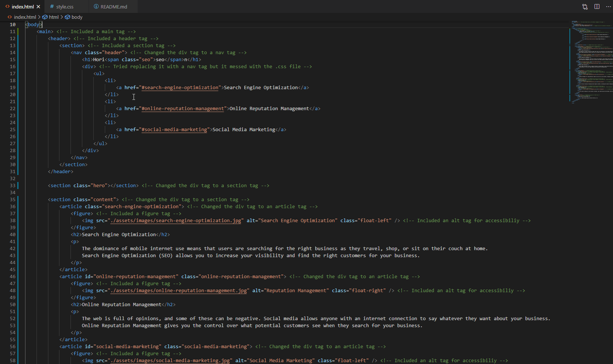
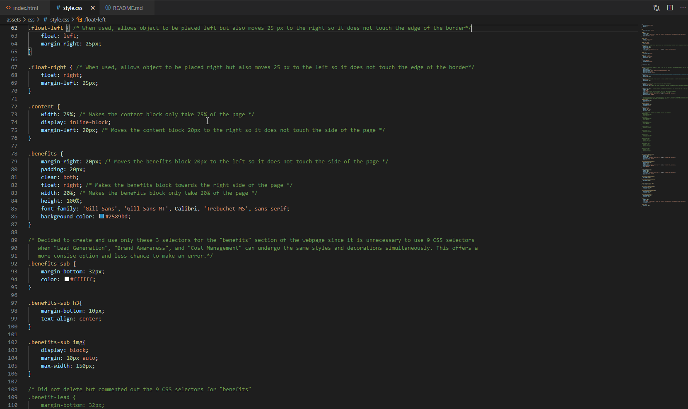
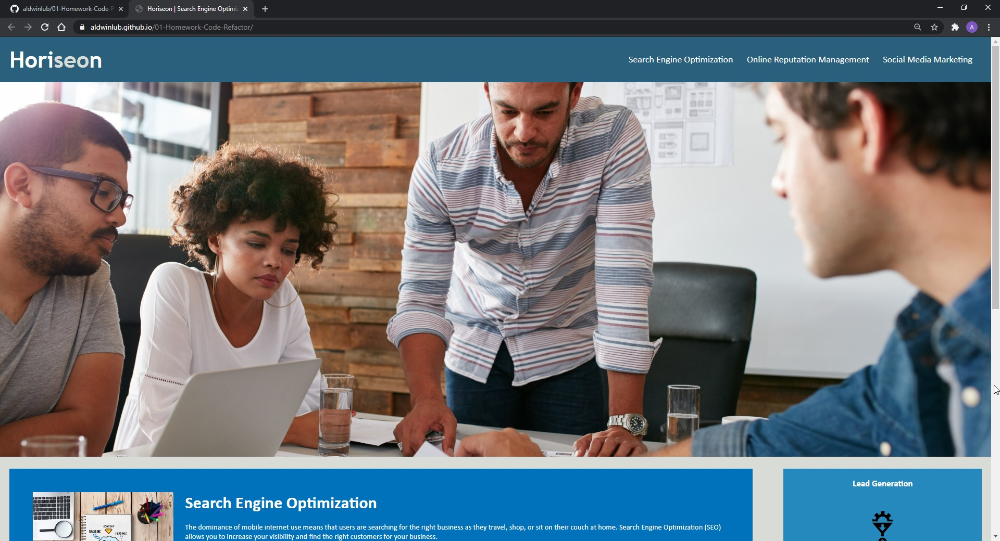
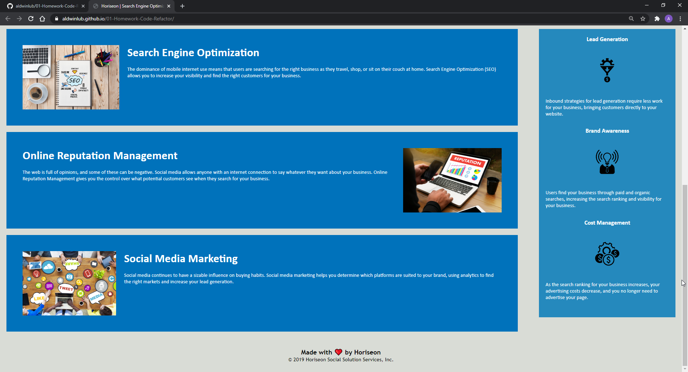

# 01-Homework-Code-Refactor

## An Overview Of What I Managed To Do

This week, we were assigned to **refactor** existing code which basically means to touch up the preexisting code given to us without changing its overall functionality. A reason as to why we are doing this is to get accustomed with working with other people's code, learn how to make certain code more accessible for everyone, and to optomize the webapge for search engines. These are basically the requirements in order to fullfil the acceptance criteria and, ultimately, the user's story.

The accessibility aspect must include semantic HTML which emphasizes that communication is key when creating any webpage. I achieved this by making sure that I had alt tags and descriptions in the images that were linked. I also made sure that I had at least a main, header, and a footer tag in the index.html file of my refactored code and included other tags such as section, article, and figure. I commented on where I added and repalced code as well. Besides accessibility and communication, this also lets the actual code to become a little easier to read and differentiate important sections rather than having div tags everywhere. For the style.css file, I tried my best to cut out any unneccesary selectors and I also commented and tried to explain how the styles affected the overall appearance of the webpage.

## Screenshots!

Here is a snippet of the changes that I made in the index.html file:

Here is a snippet of the changes that I made in the style.css file:

Lastly, here is the overview of the Horiseon website from my GitHub Pages:

